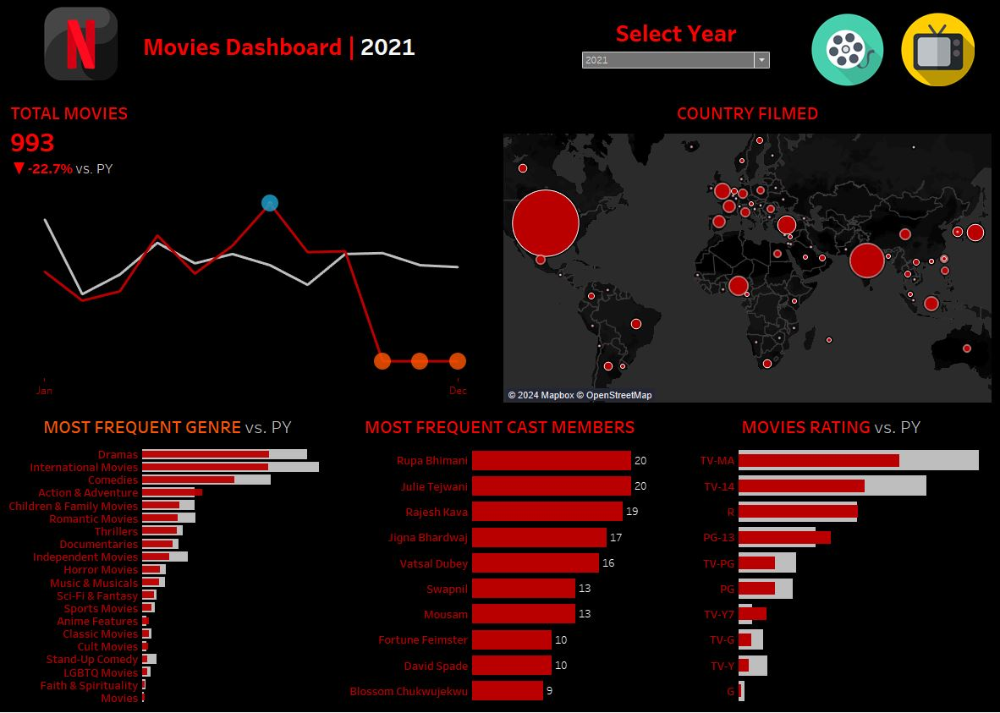

# 🎬 Netflix Analytics Dashboard

Welcome to the **Netflix Global Content Analytics** project! 🍿  
This data visualization project dives deep into Netflix’s global movie releases, helping you explore trends across genres, countries, ratings, and cast members.  
The dashboard offers a dynamic look at how Netflix’s content evolved over time, powered by **Python (for data preprocessing)** and **Tableau (for visualization)**. 🌍✨

---

## 📊 Dataset Overview

This project uses the [Netflix Movies and TV Shows Dataset](https://www.kaggle.com/datasets/shivamb/netflix-shows) containing over **8,800 titles** and **12 attributes**, including:

- `show_id`
- `type`
- `title`
- `director`
- `cast`
- `country`
- `date_added`
- `release_year`
- `rating`
- `duration`
- `listed_in` *(genres)*
- `description`

---

## 🛠️ Data Preprocessing (Python)

All data wrangling and transformation were performed in the [Preprocessing.ipynb](Preprocessing.ipynb) notebook using **Pandas** and **NumPy**.

### Key Steps:
- **Genre Explosion:** Split the `listed_in` column (multiple genres per title) into individual rows for better analysis.  
- **Cast Explosion:** Separated multiple cast members per title into unique rows to find frequent appearances.  
- **Date Cleaning:** Standardized `date_added` and extracted `year` for filtering and year-over-year comparison.  
- **Null Handling:** Replaced or removed missing `country`, `director`, and `rating` fields.  
- **Export:** Cleaned dataset saved as `netflix_cleaned.csv` for Tableau ingestion.

---

## 📈 Tableau Dashboard Highlights

### 🎥 Movies Dashboard
- **Total Movies KPI:** Displays total number of movies per year and the YoY (Year-over-Year) change percentage.  
- **Country Filmed Map:** Interactive world map showing where Netflix movies were filmed.  
- **Most Frequent Genres:** Visualizes the most common genres globally.  
- **Frequent Cast Members:** Highlights the top recurring actors/actresses.  
- **Movies Rating Distribution:** Compares ratings (TV-MA, PG-13, etc.) vs previous year.  

### ⚙️ Interactive Features
- **Select Year Parameter:** Choose a specific year to update all visuals dynamically.  
- **YoY Comparison:** Calculated fields for CY (Current Year) vs PY (Previous Year) movie count and % difference.  
- **Custom KPIs & Highlights:** Key performance indicators for trends in content production.

---

## 🧮 Tableau Calculations

**Movies Dashboard Fields:**
| Metric | Description |
|--------|--------------|
| `CY Movies` | Count of unique movies in the selected year |
| `PY Movies` | Count of unique movies in the previous year |
| `% Diff Movies` | % change between CY and PY |
| `Min/Max Movies` | Window functions to find yearly extremes |

---

## 📸 Dashboard Preview

### Movies Dashboard  

---

## 💡 Tools & Technologies

| Category | Tools Used |
|-----------|-------------|
| Data Cleaning | Python, Pandas, NumPy |
| Visualization | Tableau |
| Data Source | Netflix Dataset (Kaggle) |
| Design | Netflix Theme (Black & Red) |

---

## 🚀 Key Insights

- **Dramas** and **International Movies** dominate Netflix’s global catalog.  
- Majority of Netflix content carries **TV-MA** or **TV-14** ratings.  
- Notable drop in total movies released in 2021 compared to previous years.  
- USA, India, and UK remain the top filming countries.

---

## 🙌 Acknowledgments
Dataset sourced from [Kaggle: Netflix Movies and TV Shows](https://www.kaggle.com/datasets/shivamb/netflix-shows).  
Special thanks to the **Tableau Community** for visualization inspiration and design ideas.

---

## 🧠 Author
**Your Name**  
📧 [your.email@example.com]  
🔗 [Tableau Public Dashboard](https://public.tableau.com/app/profile/yourname/viz/NetflixDashboard)  
🔗 [GitHub Repository](https://github.com/yourusername/netflix-analytics-dashboard)

---
⭐ *If you found this project insightful, consider giving it a star on GitHub!* ⭐
